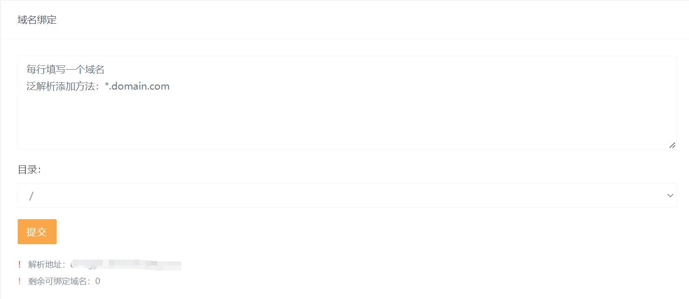

# 绑定域名

## 界面概览

### 域名绑定输入框

在输入框中可以输入需要绑定到主机的域名。每行填写1个域名。润云数据 Bthost 虚拟主机绑定域名时支持泛解析域名。

### 目录

将域名绑定到主机的子目录。例如，主机为 runyun-test 绑定目录设为 foo ，则访问域名指向 runyun-test/foo 的文件。

### 提交按钮

提交上述信息。

### 解析地址

需要绑定的域名解析地址。比如，提供的解析地址是 foo.runyun.cc ，则待绑定域名需要在 DNS 服务商处添加解析 CNAME ，记录值为 foo.runyun.cc 。

### 剩余可绑定域名

由您选择的“绑定域名数”决定。