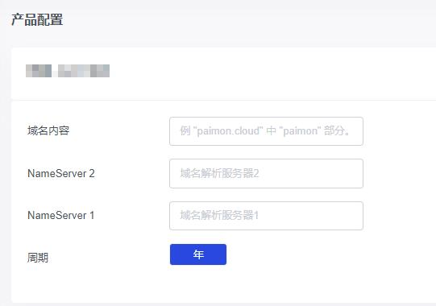

# 在润云数据智简魔方控制台注册通用域名

润云数据稍早已在智简魔方控制台提供域名注册服务。在订购页，您将看到以下字段。

## 域名内容

域名内容即一级域名除顶级域名外的内容，这是一些示例：

如果您希望注册的域名是 incloudify.com ，则此栏目填写 incloudify 。

如果您希望解析 www.incloudify.com ，则此栏目仍然填写 incloudify ，并在注册完成后前往您的 DNS 管理商解析 www 二级域名。

## NameServer

NameServer 是指 DNS 服务商的域名解析服务器。您可以先到诸如 Cloudflare 等新建一个域名，您将得到服务商提供的他们的 NameServer 服务器，填写在此栏即可。

## 注册完成后如何解析域名？

在润云数据智简魔方控制台注册的域名， DNS 服务应当在其他服务商。润云数据没有操作您的 DNS 的权限，因此请您自行前往相关 DNS 服务商查阅他们的文档。