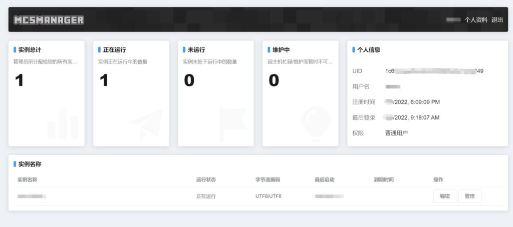

# 产品概述

润云数据容器云 MCSM 面板服务器是一款基于润云数据协作云产品中进行轻量级虚拟化的服务器。产品采用 LXC 虚拟化 Docker 容器技术，实现快速启动、减小占用、降低成本。

## 特性

 - 安全的独立应用容器空间
 - 在线开启、关闭容器实例
 - 在线命令输入与内容输出，在线命令行管理
 - 在线文件管理、在线文件编辑
 - 可视化配置文件编辑
 - 分布式服务端服务
 - 计划任务管理
 - 崩溃自动恢复、维护自动恢复
 - 可扩展资源与存储
 - 基础业务安全防护